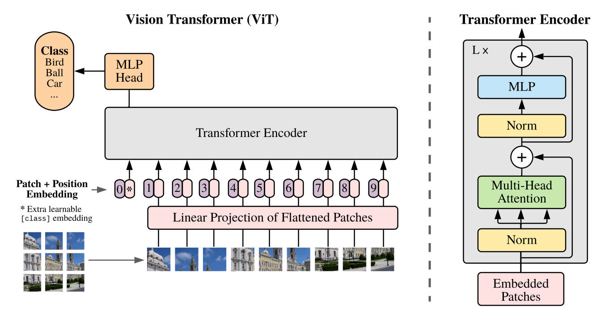
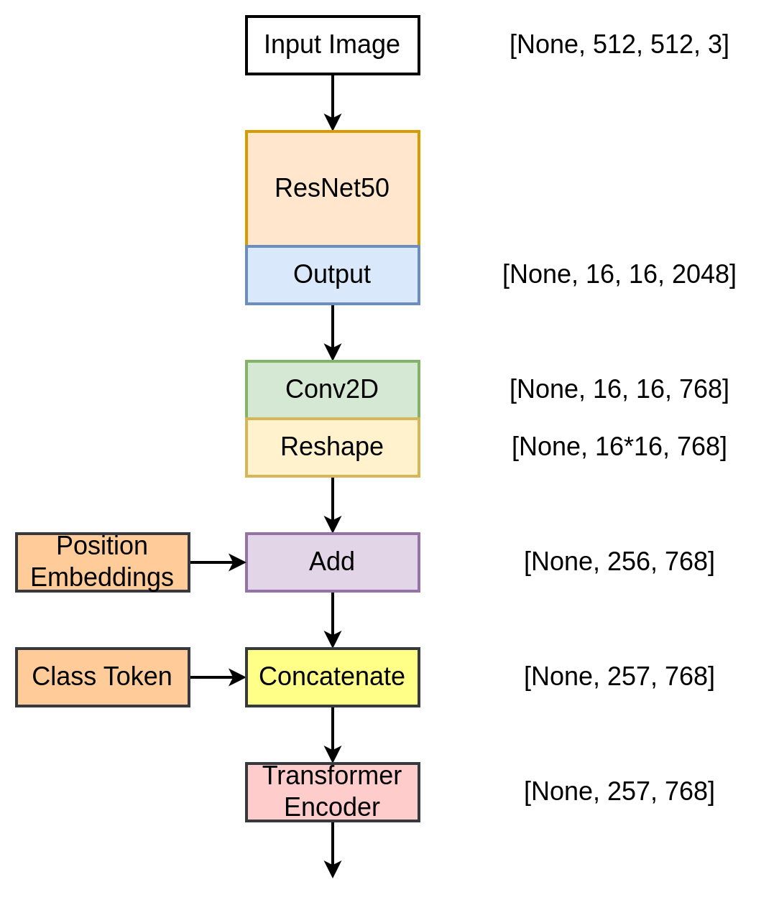

# Fine tune Resnet50 model using Vision image transformer ViT in Tensorflow
# Vision Transformer (ViT) in TensorFlow.
The repository contains the code for the implementation of the Vision Transformer in the TensorFlow framework.  

- Arxiv Paper: [AN IMAGE IS WORTH 16X16 WORDS:TRANSFORMERS FOR IMAGE RECOGNITION AT SCALE](https://arxiv.org/pdf/2010.11929.pdf)

## Architecture
|  |
| :--: |
| *The block diagram of the Vision Transformer along with the Transformer Encoder.* |

## The follow architecture is the one which is implemented in this repo
|  |
| :--: |
